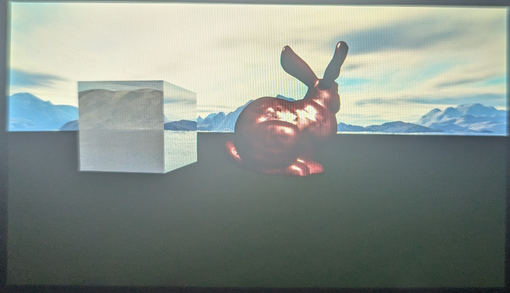

# PSVita Homebrew - First Release

Welcome to my first PSVita homebrew project! This homebrew features a simple 3D scene with a skybox, a mirror, and a bunny model. I’ve included shaders for coloring the bunny, as well as specialized shaders for rendering the skybox and the mirror.

## Features

- **Skybox:** A dynamic skybox providing the background environment for the scene.
- **Mirror:** A reflective surface that shows the reflections of the bunny model and the skybox.
- **Bunny Model:** A basic 3D model of a bunny, rendered with custom shaders.
- **App icon and banner** Icon and banner in the LiveArea on the Vita.

## Future Enhancements

In future updates, I plan to add:

- **Realistic Player Movement:** Improved controls and movement mechanics for a more immersive experience.
- **More Types of Lights:** Support for additional light types to create more dynamic and varied lighting effects.
- **Textures:** Integration of texture mapping for models and the environment.

## Installation and Usage

To test the homebrew:

1. Download the `.vpk` file from the [Releases](https://github.com/irolup/Driewer_Vita/releases/tag/v.1.0) section.
2. Transfer the `.vpk` file to your PSVita.
3. Launch it in the LiveArea.

## Screenshot

Here’s a preview of the scene:

